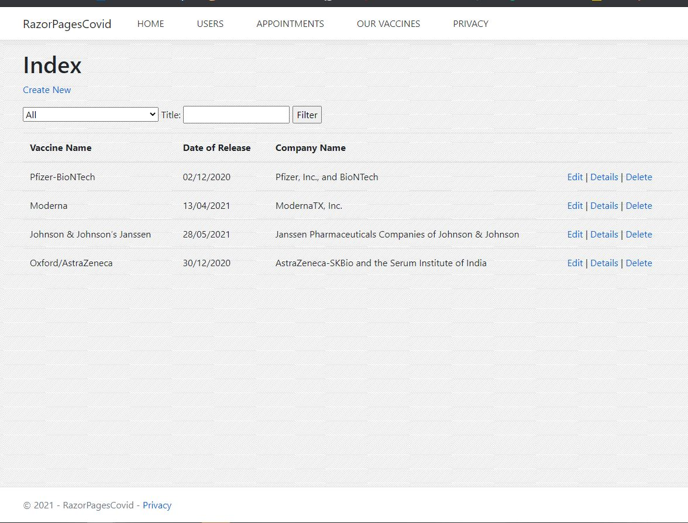
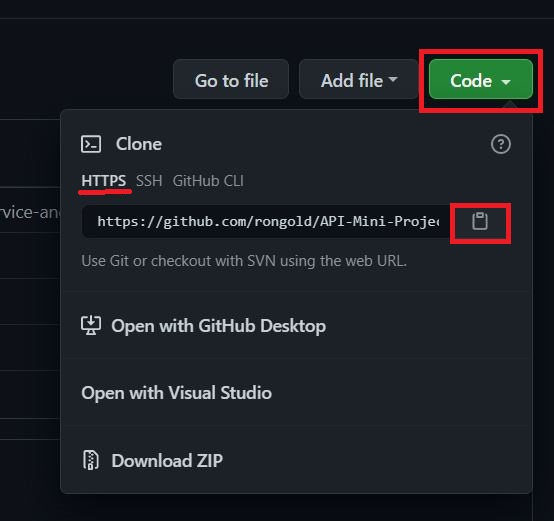
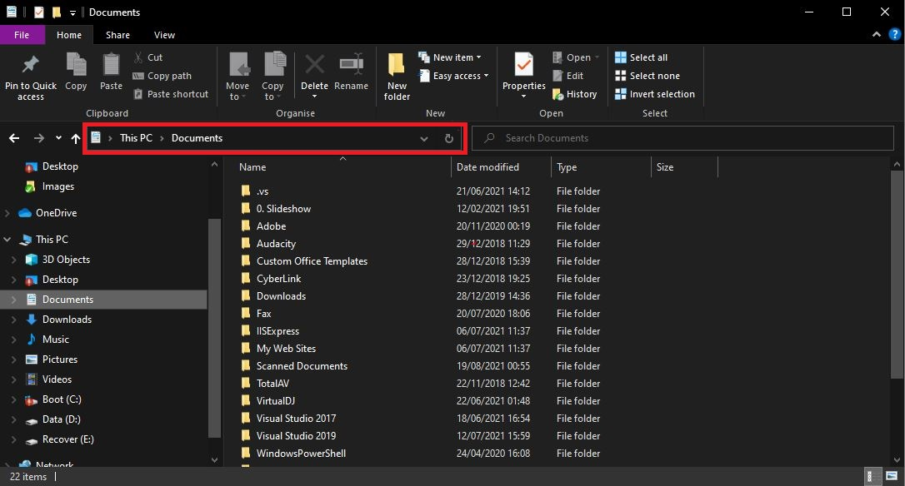
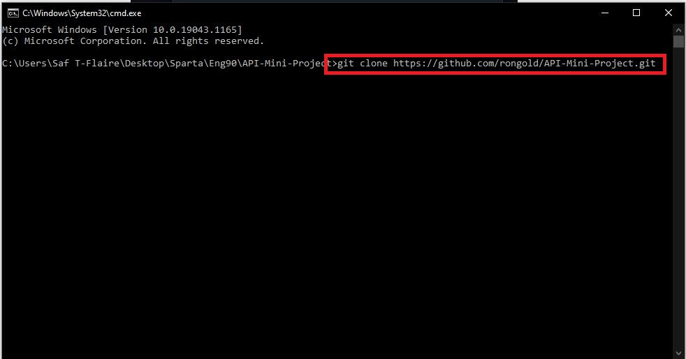
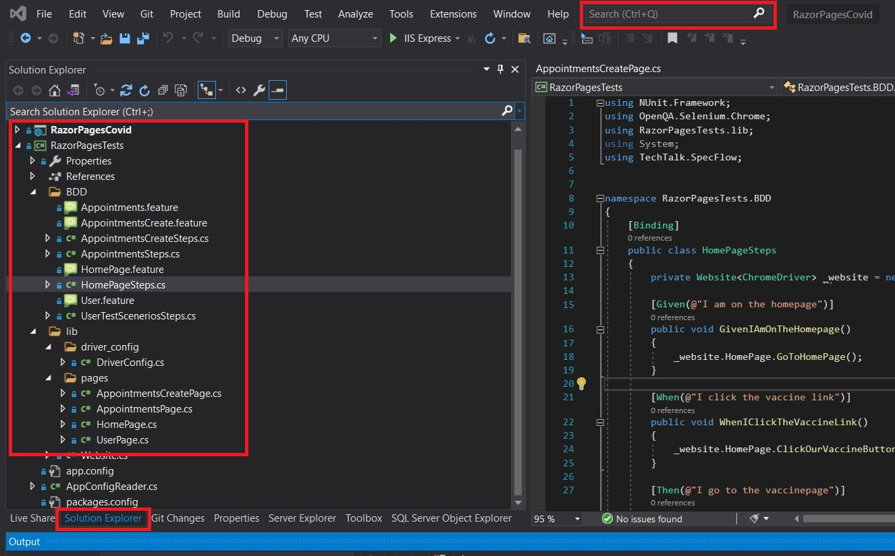
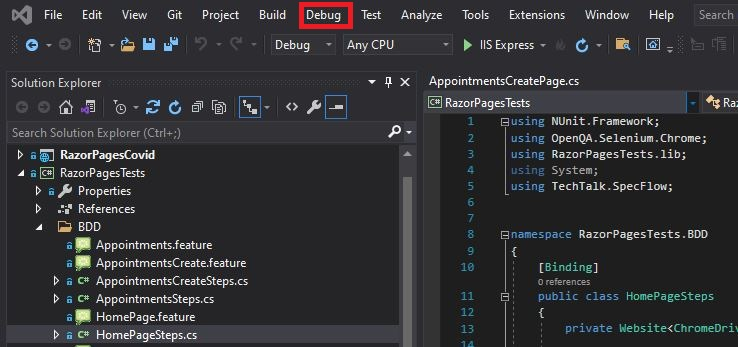
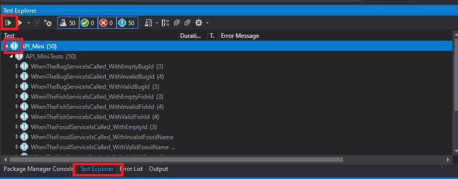

# Using Selenium to Test Web Pages

#### Introduction - Project Description

Project goal was to create a Web Test Framework and test (using SpecFlow and Page Object Models) the RazorPagesCovid website.
Each test should correspond to a user story and scenario, annotating which user stories or scenarios were missing.  Create a defect report for each defect you find.
Meet periodically with the Developer team, whose work you are testing, to triage defects and report missing user stories/scenarios. Added the defects and missing requirements to the project boards.  Once fixed, the tests can be performed again and close or reopen the defect.

### Download Visual Studio

Follow instruction on documentation to download latest [Visual Studio](https://docs.microsoft.com/en-us/visualstudio/install/install-visual-studio?view=vs-2019).

This Framework was built with Visual Studio 2019 and may operate differently according to the version you are using.

### Clone Repository 

1. On GitHub, navigate to the main page of the repository

2. Above the list of files, click **Code**.

3. To clone the repository using HTTPS, under "Clone with HTTPS", click copy button 

   or copy the Github link shown.

   

4. Open the folder where you want to save the cloned repository.

   

5. Type "cmd" in the file directory and press ENTER.

6. In the console panel (that opened) type "git clone " + the link of the cloned repository copied and press ENTER.

   

### Set up Visual Studio

1. Open the folder: "Mini-Project-Razor"

2. Open the folder: "RazorPagesCovid"

3. Open the application: "RazorPagesCovid.sln"

4. In Search bar type "Solution Explorer" and press Enter

   Check "RazorPagesCovid" and  "RazorPagesTests" solution projects are present

   

5. Click on the "Build" tool option on the top

   On the drop down click on the "Clean Solution"

   Proceed to click on the "Build Solution"

   

   

### Run Tests

1. Click on the "Debug" tool option on the top

   On the drop down click on the "Start Without Debugging"

   A Window Page Should Open Up

   Leave the page Open

   

2. Go back onto Visual Studio

3. Click on "Test Explorer" on the bottom of Visual Studio

4. Click on the Run button

   Check all tests

   

   